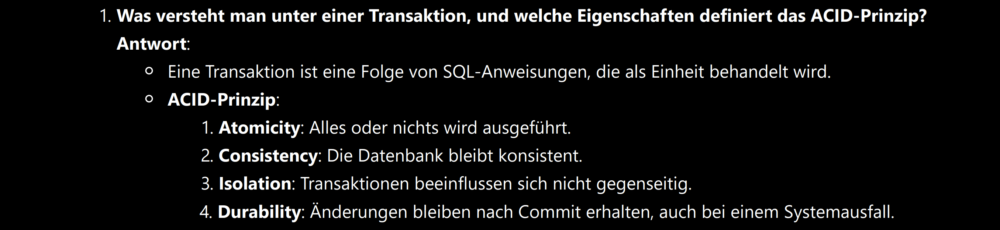
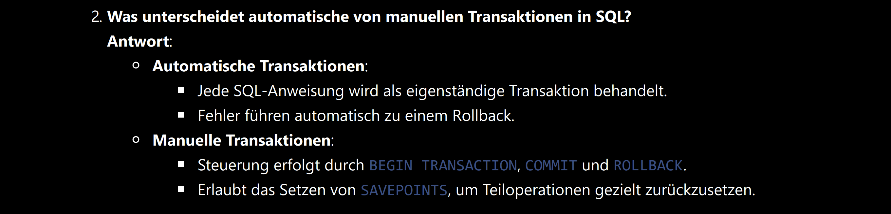
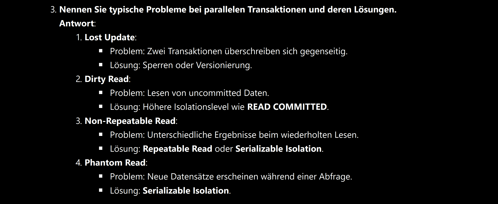
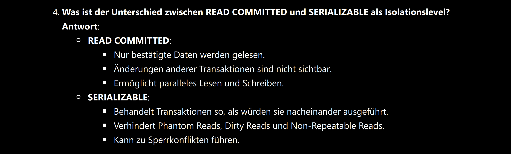
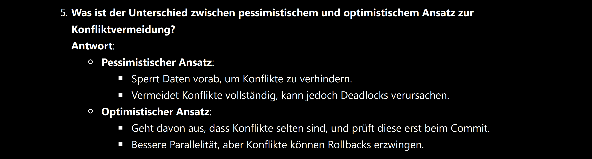
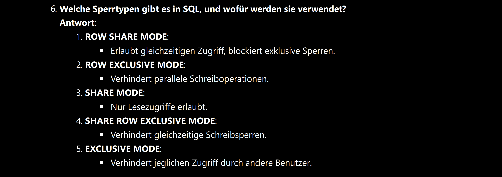
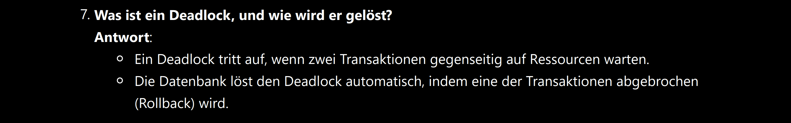
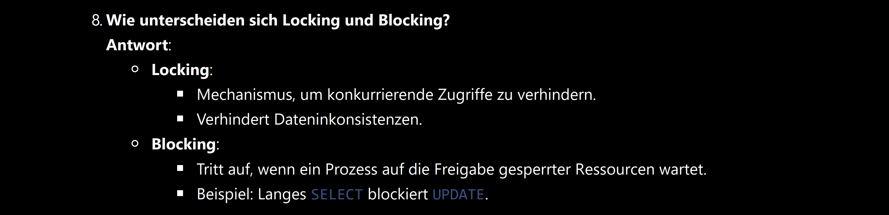
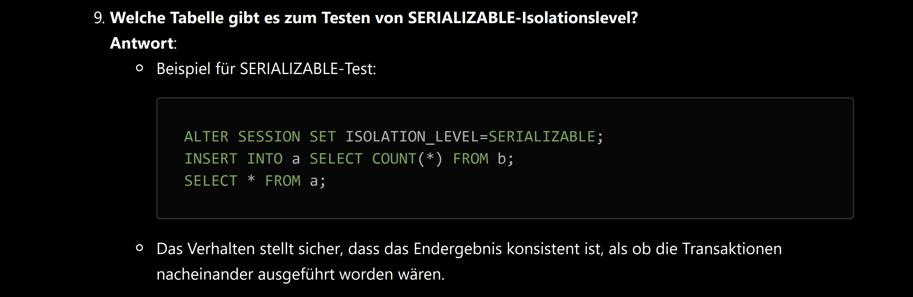

###### <div align="center"> Transaktionen, Isolationslevel & Sperrmechanismen </div>
 
> [!WARNING]
> <details>  
>  <summary align="center"> 👉🏼 𝕿𝔬𝖕 𝕾𝔢𝖈𝔯𝖊𝔱 👈🏼 🖱️<sup><sub>click</sub></sup> </summary>  
>  
> 
> 
> 
> 
> 
> 
> 
> 
> 
>
> </details>

<!-- TRANSAKTIONEN -->

# **Ⅰ** ) ***Transaktionen***  
<div align="center"> 

  Eine *Transaktion* ist eine **Folge von SQL-Anweisungen**, die **als Einheit behandelt** wird

 - ## **<div align="left"> *ACID*-Prinzip: </div>**  

  | A | **Atomicity**:   | *Alles oder nichts wird ausgeführt*                 |
  |:-:|             ---: | :--                                                 |
  | C | **Consistency**: | *Der Zustand bleibt konsistent*                     |
  | I | **Isolation**:   | *Transaktionen beeinflussen sich nicht gegenseitig* |
  | D | **Durability**:  | *Änderungen sind nach Commit dauerhaft*             |
</div>    


--- 
<div align="left">

- ### *Beispiele für Transaktionen* ( **TX** )   

 |         *Transaktionen* |  *Erklärungen*                                  |
 |                    ---: | :--                                             |
 | **`SELECT`**            | *Beginnt TX automatisch* - Wählt Daten aus      |
 | **`INSERT`**            | *Beginnt TX automatisch* - Aktualisiert Daten   |
 | **`DELETE`**            | *Beginnt TX automatisch* - Löscht aus den Daten |
 | **`BEGIN TRANSACTION`** | *Beginnt eine Transaktion explizit*             |
 | **`COMMIT`**            | *Beendet TX* - Macht Änderungen dauerhaft       |
 | **`ROLLBACK`**          | *Beendet TX* - Macht Änderungen rückgängig      |
</div>    

---
## **Ⅰ** ***a*** ) *Einführung* in ***TX***
  - ### **Multi-User-Datenbanken**:  
    Ermöglichen gleichzeitigen Zugriff durch mehrere Benutzer
    - **Lesen** ist *konfliktfrei*
    - **Schreiben** *kann Konflikte verursachen* ( zB. paralleles Ändern derselben Daten )

  - ### **Ziele von Transaktionen**:
    - Sicherstellen von Konsistenz, auch bei parallelen Zugriffen
    - Effizientes Schreiben und Lesen ohne Blockierungen

--- 
## **Ⅰ** ***b*** ) *Herausforderungen* von ***TX***
  - ### **Mehrere Operationen**:
      *Transaktionen gewährleisten, dass mehrerer Operationen* **vollständig ausgeführt** *werden* ***oder*** **keine**
  - ### **Korrekte Zwischenstände**:
      *Abfragen während einer Transaktion können* **inkorrekte Werte** *liefern*
  - ### **Maximale Parallelität**:
      **Gleichzeitiges Lesen** ***und*** **Schreiben** *ermöglichen*

---
## **Ⅰ** ***c*** ) *Transaktionssteuerung* in **SQL**
  - ### **Automatische Transaktionen**:
    - ***Standardverhalten***: *Jedes SQL-Statement* (`UPDATE`, `INSERT`, `DELETE`) *wird als Transaktion behandelt*
    - ***Fehler*** führen zu einem **automatischen Rollback**
  
  - ## **Manuelle Transaktionen**:
    - Steuerung mit `BEGIN TRANSACTION`, `COMMIT` und `ROLLBACK`

---
## **Ⅰ** ***d*** ) *Typische* ***Probleme*** *bei* ***TX***
  1) - **Lost Update**  
       Zwei Transaktionen überschreiben sich gegenseitig  
       > **Lösung**: ***Sperren*** *oder* ***Versionierung***
  2) - **Dirty Read**  
       Lesen von uncommitted Daten einer anderen Transaktion  
       > **Lösung**: *Verwendung strengerer* ***Isolationslevel*** (zB. `READ COMMITTED`)
  3) - **Non-Repeatable Read**  
       Wiederholtes Lesen derselben Daten liefert unterschiedliche Ergebnisse  
       > **Lösung**: ***`SERIALIZABLE` Isolation*** ( ..~`REPEATABLE READ`~ **NICHT in OracleSQL**.. ) 
  4) - **Phantom Read**  
       Neue Datensätze erscheinen während einer Abfrage  
       > **Lösung**: ***`SERIALIZABLE` Isolation***

------------------------------------------------------------------------------------------------------------------------
<!-- ISOLATIONSLEVEL -->

# **Ⅱ** ) ***Isolationslevel***

**Oracle-Standard**
  - Oracle verwendet `READ COMMITTED` als **Standard-Isolationslevel**
  - Anpassung mit `ALTER SESSION SET ISOLATION_LEVEL`

### Vergleich der Isolationslevel
<div align="center"> 

|   IsolationsLevel   | **Dirty Read** | **Non-Repeatable Read** | **Phantom Read** |
|:-------------------:|:--------------:|:-----------------------:|:----------------:|
|`READ UNCOMMITTED`   |       Ja       |              Ja         |         Ja       |
| `READ COMMITTED`    |     Nein       |              Ja         |         Ja       |
| ~`REPEATABLE READ`~ |     Nein       |            Nein         |         Ja       |
|    `SERIALIZABLE`   |     Nein       |            Nein         |       Nein       |
</div>

------------------------------------------------------------------------------------------------------------------------
<!-- SPERRMECHANISMEN -->

# **Ⅲ** )  ***Optimistische*** **vs.** ***Pessimistische Ansätze***

## **Ⅲ** ***a*** ) ***Pessimistischer*** *Ansatz* (**Locking**)
##### Definition:
> <p align="center"> Sperrt Daten, um Konflikte zu verhindern </p>

  - **Vorteile**: *Vermeidet Konflikte vollständig*
  - **Nachteile**: *Kann* ***Deadlocks*** *verursachen, blockiert parallelen Zugriff*
    > *Beispiel*: `UPDATE`-Operationen sperren betroffene Datensätze

## **Ⅲ** ***b*** ) ***Optimistischer*** *Ansatz* (**Versionierung**)
##### Definition:
> <p align="center"> Geht davon aus, dass Konflikte selten sind, (und nutzt Snapshots)</p>

  - **Vorteile**: *Bessere Parallelität*
  - **Nachteile**: *Konflikte werden erst beim* `COMMIT` *erkannt, was zu* ***Rollbacks*** *führen kann*
    > *Beispiel*: Zwei Benutzer bearbeiten denselben Datensatz unabhängig voneinander

---
## **Ⅲ** ***c*** ) ***Sperrmechanismen*** (**Locks**)
**Typen von Sperren**:
  1) - `ROW SHARE MODE`: *Erlaubt gleichzeitigen Zugriff, blockiert exklusive Sperren*
  2) - `ROW EXCLUSIVE MODE`: *Verhindert parallele Schreiboperationen*
  3) - `SHARE MODE`: *Nur Lesezugriffe erlaubt*
  4) - `SHARE ROW EXCLUSIVE MODE`: *Verhindert gleichzeitige Schreibsperren*
  5) - `EXCLUSIVE MODE`: *Verhindert jeglichen Zugriff durch andere Benutzer*

##### *Beispiel*:
  > ```sql
  > LOCK TABLE dept IN ROW SHARE MODE; 
  > LOCK TABLE dept IN EXCLUSIVE MODE;
  > ```

---
## **Ⅲ** ***d*** ) ***Deadlocks und Blockierungen***
  - ### **Deadlocks**
      - Tritt auf, wenn zwei Transaktionen gegenseitig auf Ressourcen warten
        > **Lösung**: *Rollback einer der Transaktionen durch das DBMS*

  - ### **Blocking**
      - Prozesse warten auf die Freigabe gesperrter Ressourcen
        > *zB.* Langes `SELECT` blockiert parallele `UPDATE`-Operationen

---
> ### **Ⅳ** ) 
> ### <p align="center"> ***Beispiele*** </p>

> ##### *1* )
  > ```sql
  > LOCK TABLE emp IN SHARE MODE;
  > INSERT INTO dept VALUES (99, 'NinetyNine', 'Earth');
  > DELETE FROM dept WHERE deptno = 99;
  > SELECT * FROM dept;
  > ```

> ##### *2* )
  > ```sql
  > ALTER SESSION SET ISOLATION_LEVEL=SERIALIZABLE;
  > INSERT INTO a SELECT COUNT(*) FROM b;
  > SELECT * FROM a;
  > ```

> ##### *3* )
  > In der Praxis die Einführung einer Versionsspalte verbreitet durchgesetzt
  >  Diese muss bei ***JEDEM Update*** an *allen Stellen im Programmcode* ***inkrementiert*** werden (*erfolgt meistens durch Framework*) 
  > ```sql
  > ALTER TABLE emp
  >   ADD vers NUMBER DEFAULT 0;  -- hinzufügen der versionsspalte
  >
  > UPDATE system.emp
  >   SET
  >     sal=1300,
  >     vers=vers+1               -- inkrementieren der versionsspalte
  >   WHERE empno=7369
  >    and vers=0;                -- versionsnummer wird hier abgeglichen
  > ```   
---
