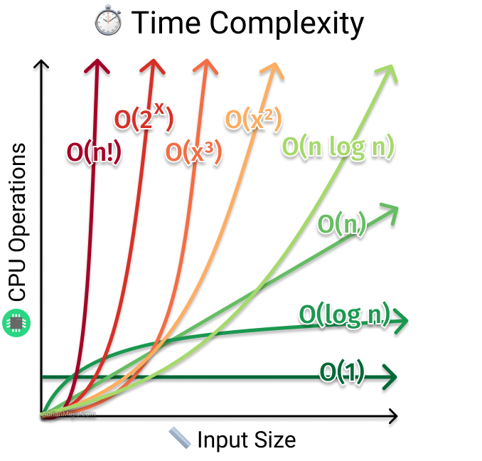

###### <div align="center"> Laufzeitkomplexität </div>
> <p align="center"> 👉🏼 𝕿𝔬𝖕 𝕾𝔢𝖈𝔯𝖊𝔱 👈🏼 </p>
<!--
> [!WARNING]
> <details>  
>  <summary align="center"> 👉🏼 𝕿𝔬𝖕 𝕾𝔢𝖈𝔯𝖊𝔱 👈🏼 🖱️<sup><sub color="red">click</sub></sup> </summary>  
>  
> 
> 
> 
>  
> 
> 
> </details>
-->
<!-- LAUFZEIT KOMPLEXITÄT -->

# **Ⅰ** ) <p align="center"> ***Laufzeitkomplexität*** </p>
   - *beschreibt, wie lange ein eine SQL-Abfrage im Verhältnis zur Größe der Eingabedaten läuft*  
   - *Je schneller die Laufzeit im Verhältnis zur Eingabedatenmenge wächst, desto komplexer ist der Algorithmus*

<div align="center">
   

</div>

---    
## **Ⅰ** ***a*** ) *Warum ist Laufzeitkomplexität wichtig?*
   - **Performance**:
     > Eine Abfrage mit hoher Laufzeitkomplexität kann bei großen Datenmengen sehr lange dauern oder zu einem Absturz führen
   - **Skalierbarkeit**:
     > Wenn die Datenmenge wächst, sollten Abfrage idealerweise nicht proportional langsamer werden
   - **Ressourcenverbrauch**:
     > Langsame Abfragen verbrauchen mehr Serverressourcen (CPU, Speicher) und können andere Benutzer beeinträchtigen

---
## **Ⅰ** ***b*** ) *Beispiele* der Laufzeitkomplexitäten:
   - ## 𝒪<sub>(1)</sub> :
       ***konstante Zeit/Komplexität***: die Laufzeit hängt nicht von der Datenmenge ab
       - ***Beispiel 1***:
         > Eine Abfrage, die nur die erste Zeile einer Tabelle ausgibt
         > ```sql
         > SELECT * FROM customers WHERE customer_id = 123;
         > ```
       - ***Beispiel 2***:
         > Zählen aller Zeilen in einer Tabelle mit einem Index auf der gesamten Tabelle
         > ```sql
         > SELECT COUNT(*) FROM customers;
         > ```

   - ## 𝒪<sub>(n)</sub> :
       ***lineare Komplexität***: die Laufzeit ist propertional zur Datenmenge
       - ***Beispiel 1***:
         > Eine Abfrage, die jede Zeile einer Tabelle durchläuft
         > ```sql
         > SELECT * FROM orders;
         > ```
       - ***Beispiel 2***:
         > Berechnung einer Summe über alle Werte einer Spalte
         > ```sql
         > SELECT SUM(amount) FROM orders;
         > ```

   - ## 𝒪<sub>(n²)</sub> :
       ***quadratische Komplexität***: die Laufzeit wächst quadratisch mit der Datenmenge
       - ***Beispiel 1***:
         > Verschachtelte Schleifen (vereinfacht, in der Praxis oft ineffizient)
         > ```sql
         > SELECT * FROM customers c1, customers c2
         > WHERE c1.city = c2.city;
         > ```
       - ***Beispiel 2***:
         > Berechnung aller möglichen Kombinationen ohne Indizes
         > ```sql
         > SELECT * FROM products, colors;
         > ```    	
     
   - ## 𝒪<sub>(log n)</sub> :
       ***logarithmische Komplexität***: die Laufzeit wächst logarithmisch mit der Datenmenge
       - ***Beispiel***:
         > Binäre Suche auf einem sortierten Index (vereinfacht)
         > ```sql
         > -- Annahme: Ein Index auf customer_name ist vorhanden und sortiert
         > SELECT * FROM customers
         > WHERE customer_name >= 'Mustermann'
         > ORDER BY customer_name
         > FETCH FIRST 1 ROW ONLY;
         > ```
         
   - ## 𝒪<sub>(n log n)</sub> :
       ***superlineare Komplexität***: *liegt zwischen 𝒪(n) und 𝒪(n²)* 
       - ***Beispiel***:
         > Optimierte Sortieralgorithmen wie Quicksort
         > ```sql
         > SELECT * FROM customers ORDER BY last_name;
         > ```

   - ## 𝒪<sub>(2ⁿ)</sub> :
       ***exponentielle Komplexität***: die Laufzeit verdoppelt sich, wenn die Datenmenge um eine Einheit größer wird
       - *Beispiel*:
         > Bilden aller Paare einer Menge, Türme von Hanoi als rekursiver Algorithmus
 
   - ## 𝒪<sub>(n!)</sub> :
       ***faktorielle Komplexität***: die Laufzeit wächst mit der Fakultät der Datenmenge
       - *Beispiel*:
         > Problem des Handlungsreisenden 

---
