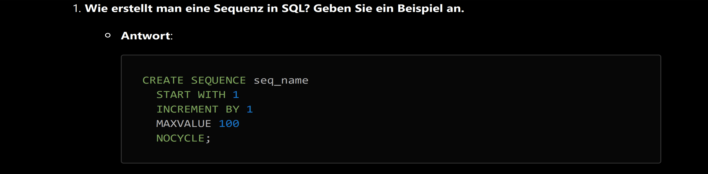

###### <div align="center"> Sequenzen - Zahlenfolgen </div>

> [!WARNING]
> <details>  
>  <summary align="center"> 👉🏼 𝕿𝔬𝖕 𝕾𝔢𝖈𝔯𝖊𝔱 👈🏼 🖱️<sup><sub color="red">click</sub></sup> </summary>  
>  
> 
> 
> 
>  
> 
> 
> </details>

<!-- SEQUENCES ERSTELLUNG -->

# **Ⅰ** ) <p align="center"> ***Sequenzen*** </p>

## **Ⅰ** ***a*** ) *Erstellen*:
    
  ```sql
  create SEQUENCE                
    allusers__u_ID        -- : name der sequenz
      START with 1          -- : startwert
      MAXvalue 100000       -- : maxwert
      MINvalue 0            -- : minwert
      INCREMENT by 1        -- : stepsize           
      noCACHE               -- : erzeugt nummern bei bedarf  
      noCYCLE               -- : keine wiederholung
  ;
  ```
    
## **Ⅰ** ***b*** ) *Löschen*:
  ```sql
  drop SEQUENCE
    allusers__u_ID;
  ```

---
## **Ⅰ** ***c*** ) *Wichtige* ***Parameter*** *und* ***Optionen***
  - `INCREMENT by`:  
     Gibt die Schrittweite an  
     > Standardwert: 1 (auch negative Werte möglich)  
  - `START with`:  
     Definiert den Startwert der Sequenz  
     > Standardwert:  *1 ⇾ aufsteigenden* Sequenzen    
     > Standardwert: *-1 ⇾ absteigenden* Sequenzen     
  - `MINvalue / MAXvalue`:  
     Legt die minimalen und maximalen Werte fest  
    - `noMAXvalue`:  
       > Zähler läuft bis zum technischen Limit [10²⁷ - bei aufsteigenden Sequenzen]     
    - `noMINvalue`:  
       > Mindestwert: *1 ⇾ aufsteigenden* Sequenzen   
       > Mindestwert: *-10²⁶ ⇾ absteigende* Sequenzen       
  - `CYCLE / noCYCLE`:  
    - `CYCLE`:  
       > Neustart ⇾ wenn Höchstwert erreicht   
    - `noCYCLE`:  
       > Fehler ⇾ wenn Höchstwert erreicht   
  - `ORDER / noORDER`:  
    - `ORDER`:  
       > garantiert die Reihenfolge, jedoch keine lückenlose Nummerierung   
  - `CACHE / noCACHE`:  
    - `CACHE`:  
       > Generiert und speichert mehrere Nummern im Voraus (Standard: 20)   
     - `noCACHE`:  
       > Erzeugt Nummern bei Bedarf ⇾ kann bei Systemfehlern sicherer sein   

---
> - ### Anwendung:
>
> ```sql
> create TABLE
>   ALLUSERS     -- : Tabellen-Name
>   ( --columns--datatypes----default-values-------------------unnamed-constraints
>      u_ID      NUMBER       DEFAULT allusers__u_ID.nextval,
>      u_Name    VARCHAR(30)                                   NOT NULL,
>     --named-constraints---------------------------------------------------------
>     CONSTRAINT PK_allUsers PRIMARY KEY (u_ID)
>   );
>   ```
>   
> - #### Pseudospalten:
>     `seq_name.NEXTVAL` -- Nächster Wert der Sequenz  
>     `seq_name.CURRVAL` -- Aktueller Wert der Sequenz

---
