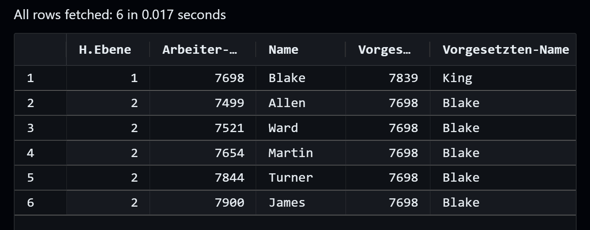

<!-- readme -->

# Ⅰ Views

---
# Ⅱ Common Table Expressions

## - die "klassische" CTE - recursive-Zählschleife:
  ```sql
  with num_row (  n  ) as (
      select                -- Anker-Query
          1 as n    

          UNION ALL         -- verbindung mit

           select           -- rekursive-Query
             n + 1 as n
           from num_row
             where n < 100  -- Abbruch-Bedingung
  )
  select *
  from num_row;
  ```

<!--
## - allgemein als `.json`:
  ```json
    "with_recursive": {
        "prefix": "*wr",
        "body": [
            "with ${1:cte_table_name} (  ${2:recutive_field}  ) as (",
            "   ",
            "  select                       -- Anchor-Query",
            "  ${2:recutive_field}          -- ",
            "  from ${4:table}              -- ",
            "    where ${5:start_condition} -- ",
            "   ",
            "   UNION ALL",
            "   ",
            "  select                       -- Recursive-Query",
            "  ${2:recutive_field}          -- ",
            "  from ${1:cte_table}          -- ",
            "    where ${6:end_condition}   -- ",
            "   ",
            ")",
            "select",
            "${7:output_field} as ${8:output_alias}",
            "from ${1:cte_table}"
        ],
        "description": "common-table-expression"
    }
  ```
-->

###### *Beispiel*: 
## - Hirarchiebenen von Angestellten & Vorgesetzten (mit Ebenen-Zähler)
   > View auf die Vornamen, um diese richtig (Case-sensitiv) auszugeben 

  - ***"Geben Sie alle Arbeiter unter 'BLAKE' aus, sowie den jeweiligen Vorgesetzten"***

 #### - Query:
 
  ```sql
  --- CTE:
  with hirarchie_ebenen (  level_counter, empno, ename, mgr  ) as (
    select
        1 as level_counter
      , empno
      , ename
      , mgr
    from
        emp
    where
        ename = 'BLAKE'
    union
    all
    select
        level_counter + 1 as level_counter
      , e.empno
      , e.ename
      , e.mgr
    from
        hirarchie_ebenen l
        join emp e on (  l.empno = e.mgr  )
    where
        l.level_counter is not null
  )
  select
    l.level_counter as "Hirarchiebene"
  , l.empno         as "Arbeiter-Nr"
  , cc.names        as "Name"
  , l.mgr           as "Vorgesetzten-Nr"
  , cm.names        as "Vorgesetzten-Name" 
  from
    hirarchie_ebenen l
    join casesensitivenames cm on (  cm.empno = l.mgr  )
    join casesensitivenames cc on (  cc.empno = l.empno  );

  ----------
  
  --- View der Namen
  create or replace view casesensitivenames as
    select
        empno
      , upper (  substr (  ename, 1, 1  ) ) || lower (  substr (  ename, 2  ) ) as names
    from emp
    with read only constraint RO_on_casesensitivenames;
  ```

#### - Ausgabe:



